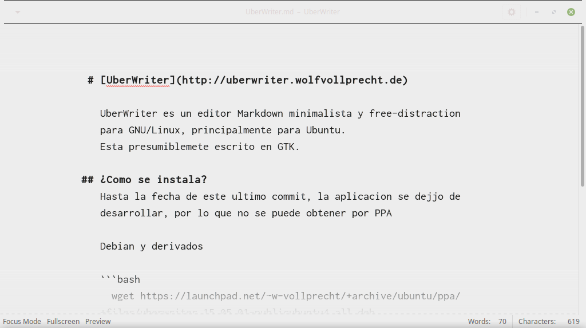
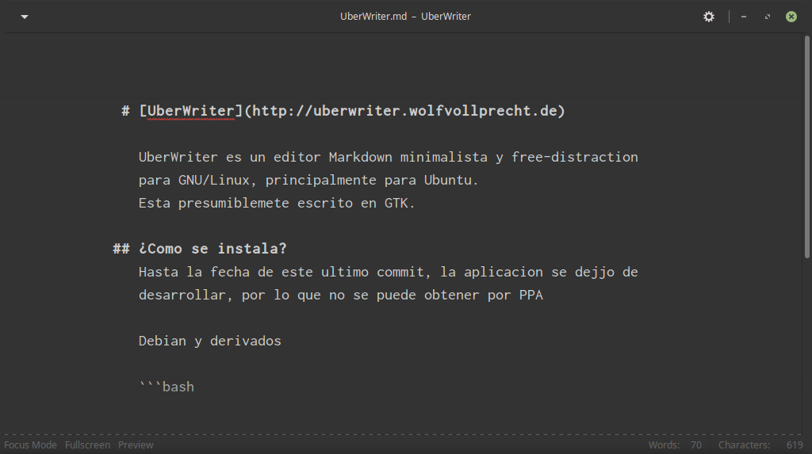
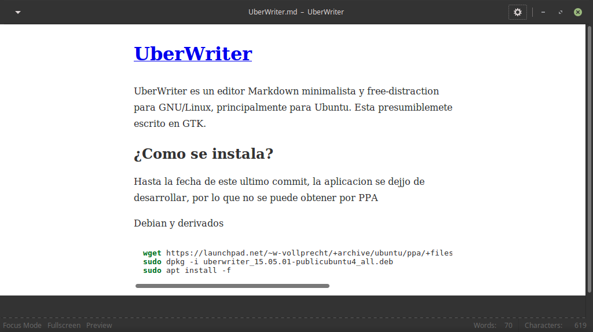

# [UberWriter](http://uberwriter.wolfvollprecht.de)

UberWriter es un editor Markdown minimalista y free-distraction para GNU/Linux, principalmente para Ubuntu.
Esta presumiblemete escrito en GTK.
Inspirado por el editor iA Writer, segun el creador.

## Caracteristicas

+ Interfaz de usuario limpia
+ Modo 'Enfocado' oscurece todo el texto excepto la linea donde estas escribiendo
+ Modo pantalla completa
+ Destacado InLine
+ Conteo de palabra y letras en tiempo real
+ Pre-visualizacion
+ Soporte para expresiones matematicas incluidas
+ Exportación a: PDF, HTML, ePub, RTF, LaTeX, etc.

## ¿Como se instala?
Hasta la fecha de este ultimo commit, la aplicación se dejo de desarrollar, por lo que no se puede obtener por PPA en las versiones actuales de Ubuntu

Debian y derivados

```bash
  wget https://launchpad.net/~w-vollprecht/+archive/ubuntu/ppa/+files/uberwriter_15.05.01-publicubuntu4_all.deb
  sudo dpkg -i uberwriter_15.05.01-publicubuntu4_all.deb
  sudo apt install -f
```

Arch Linux y derivados

```bash
  yaourt -S uberwriter
```

## Galería


**Modo normal**


**Modo oscuro**


**Pre-visualizacion**
